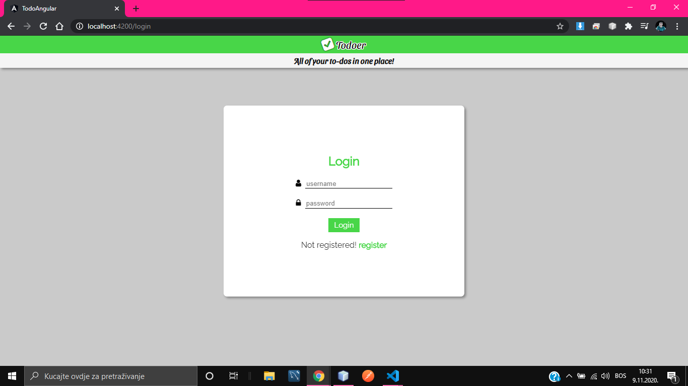
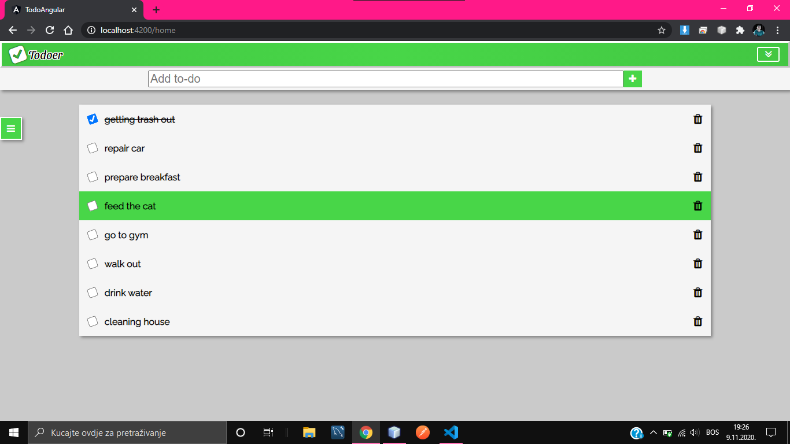
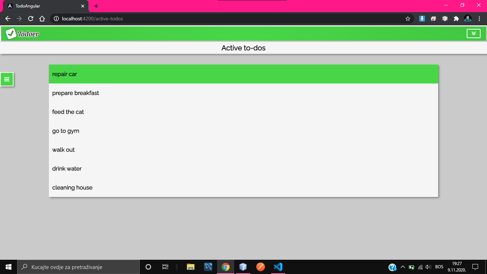
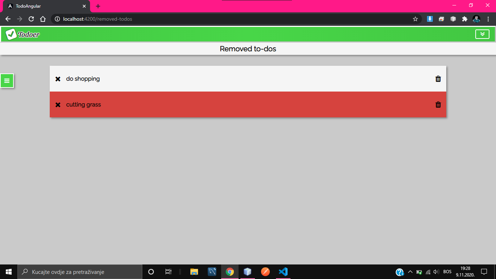
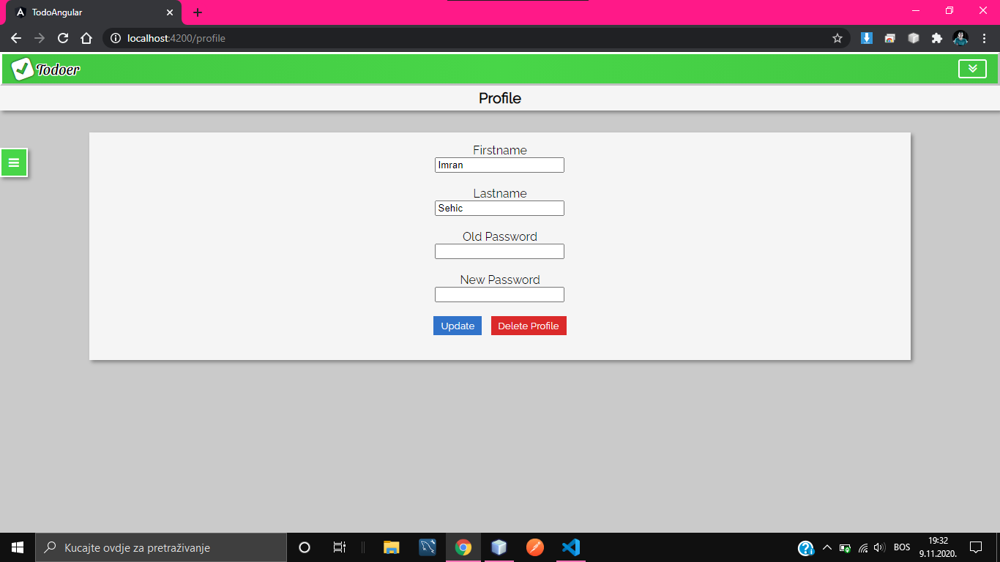
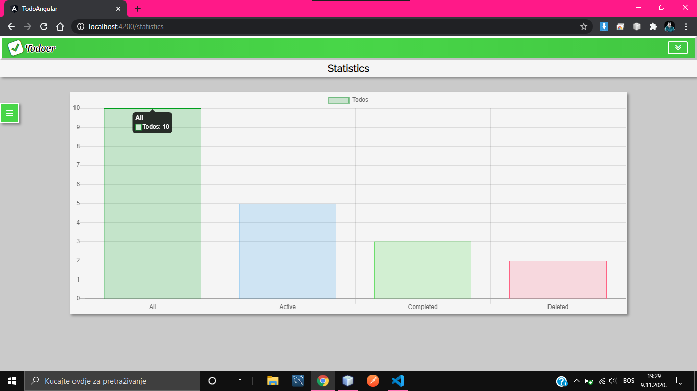
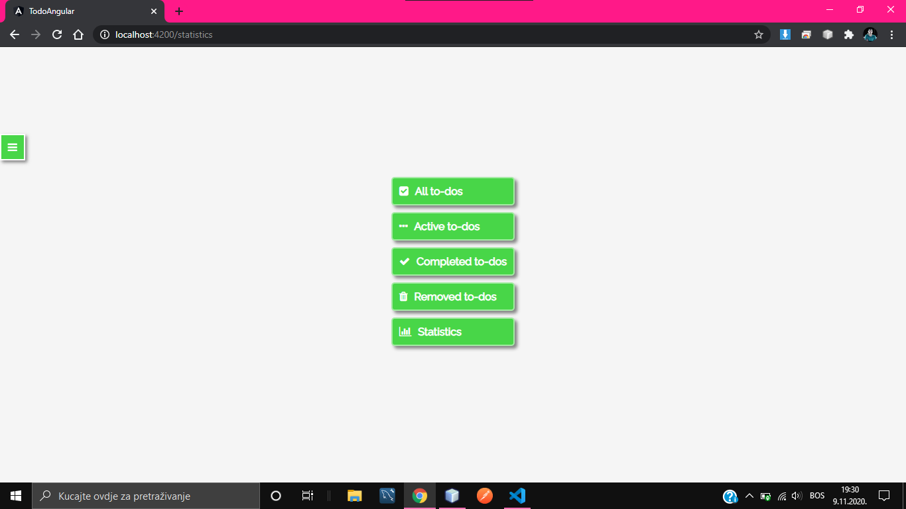

# todo-spring-boot
This is the backend for a simple todo application built in Spring Boot, the most popular Java Framework. 
The application contains the following pages: 
* login
* register
* all-todos
* active-todos
* completed todos
* removed todos
* user-profile
* statistics

<!-- -->

The frontend is built using Angular with TypeScript while the database used is MySQL. 
Below are some of the screenshot of the application.  
## 1.Login

 

## 2.All-todos

 

## 3.Active-todos

 

## 4.Completed-todos

 

## 5.Removed-todos

 

## 6.User-profile

 

## 7.Statistics

 

## 8.Navigation

 
